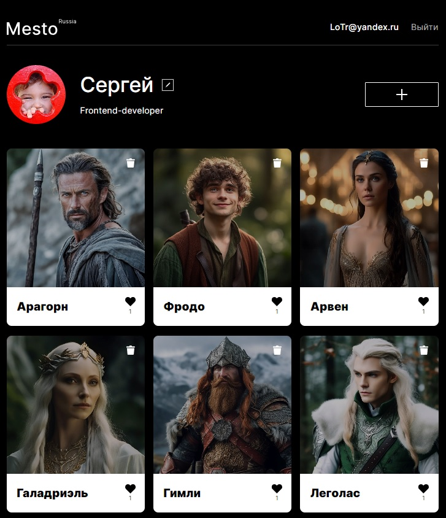

# mesto-react-auth (frontend на React)

Проект представляет собой интерактивную страницу с карточками фотографий, выполненную на React.

## [Демонстрация сайта](https://8gato8.github.io/react-mesto-auth/)

**Использованы следующие методы и технологии:**

- HTML
- CSS
- Flexbox layout
- [Методология BEM](https://ru.bem.info/methodology/ "Использована классическая схема организации файловой структуры БЭМ-проектов: Nested")
- Grid layout
- Media queries
- Figma
- JavaScript
- React
- React Router
- JSON
- Webpack

**Функционал:**

Пользователь может 
- редактировать свой профиль
- добавлять и удалять фотографии
- cтавить лайки фотографиям
  
Другие пользователи, в свою очередь, могут
- оценивать Ваши фотографии
- ставить им лайки
  
Также реализованы
- регистрация
- авторизация

**Взаимодействие с backend**

- стартовая информация о карточках и пользователе загружается с бэкенда
- при сабмите форм данные отправляются на сервер
- пользователь проходит авторизацию при каждом заходе на страницу

## Как запустить проект

`npm install` - для установки необходимых для функционирования проекта пакетов
`npm run start` — запускает проект на локальном сервере

## Статус проекта и планы по доработке
Завершён. Доработки не планируются.
